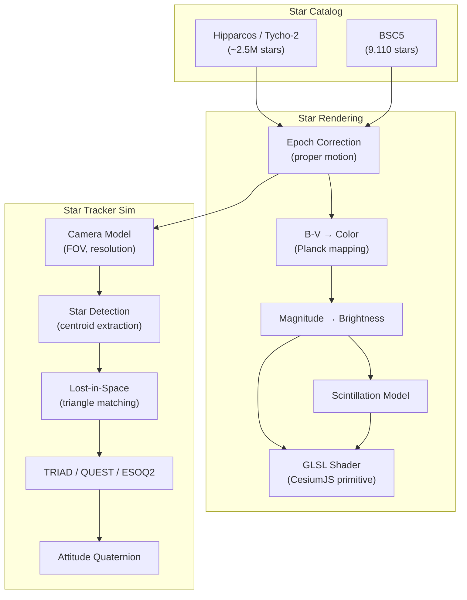
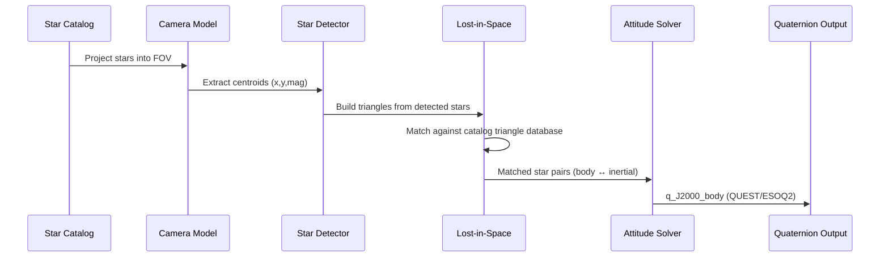

# ✨ Starfield & Star Tracker Plugin

[](https://github.com/the-lobsternaut/starfield-sdn-plugin/actions)
[](LICENSE)
[](https://en.cppreference.com/w/cpp/17)
[](wasm/)
[](https://github.com/the-lobsternaut)

**Accurate star rendering for CesiumJS with GLSL shaders (magnitude-correct brightness, B-V color mapping, proper motion, scintillation) plus star tracker simulation (TRIAD, QUEST, ESOQ2 attitude determination) and lost-in-space triangle matching.**

---

## Overview

The Starfield plugin provides two complementary capabilities:

### 1. Star Rendering (CesiumJS)
- **Magnitude-correct brightness** — visual magnitudes mapped to physically accurate point-source brightness
- **B-V color temperature** — stellar spectral colors via Planck function approximation
- **Proper motion** — star positions corrected for precession and proper motion to J2000+epoch
- **Atmospheric scintillation** — twinkle effect based on altitude and atmospheric conditions
- **GLSL shaders** — GPU-accelerated star rendering with custom CesiumJS primitive

### 2. Star Tracker Simulation
- **Star catalog matching** — identify stars in a camera FOV from a catalog
- **Lost-in-space** — initial attitude acquisition via triangle pattern matching
- **TRIAD** — two-vector attitude determination (simple, fast)
- **QUEST** — quaternion estimation from multiple star vectors (optimal)
- **ESOQ2** — efficient second-order quaternion estimator (robust)
- **Attitude output** — quaternion (J2000 ECI body frame)

---

## Architecture



### Star Tracker Pipeline



---

## Data Sources & APIs

| Source | URL | Purpose |
|--------|-----|---------|
| **Hipparcos** | [cosmos.esa.int/web/hipparcos](https://www.cosmos.esa.int/web/hipparcos) | High-precision star catalog |
| **Tycho-2** | [cds.u-strasbg.fr](https://cds.u-strasbg.fr/) | 2.5M star supplement |
| **BSC5** | Yale Bright Star Catalog | Naked-eye stars (mag ≤ 6.5) |

---

## Research & References

- Shuster, M. D. & Oh, S. D. (1981). ["Three-axis attitude determination from vector observations"](https://doi.org/10.2514/3.56311). *JGCD*, 4(1). QUEST algorithm.
- Black, H. D. (1964). "A Passive System for Determining the Attitude of a Satellite." *AIAA Journal*, 2(7). TRIAD method.
- Mortari, D. (1997). ["ESOQ: A Closed-Form Solution to the Wahba Problem"](https://doi.org/10.2514/2.4316). *JGCD*, 20(5). ESOQ2 algorithm.
- Liebe, C. C. (1993). ["Star Trackers for Attitude Determination"](https://doi.org/10.1109/7.259518). *IEEE AES Magazine*. Star tracker overview.
- Mortari, D. et al. (2004). "The Pyramid Star Identification Technique." *Navigation*. Triangle matching for lost-in-space.
- ESA (1997). *The Hipparcos and Tycho Catalogues*. ESA SP-1200. Star catalog reference.

---

## Technical Details

### B-V Color Mapping

Stars are colored by their B-V color index using a Planck function approximation:
```
T_eff = 4600K × (1/(0.92×(B-V) + 1.7) + 1/(0.92×(B-V) + 0.62))
RGB = planckToRGB(T_eff)
```

| B-V | Color | T_eff | Example Star |
|-----|-------|-------|-------------|
| -0.3 | Blue-white | 30,000 K | Spica |
| 0.0 | White | 10,000 K | Vega |
| 0.6 | Yellow | 6,000 K | Sun |
| 1.0 | Orange | 4,500 K | Arcturus |
| 1.5 | Red | 3,500 K | Betelgeuse |

### Attitude Determination Accuracy

| Method | Accuracy | Stars Needed | Speed |
|--------|----------|-------------|-------|
| TRIAD | ~arcsec | 2 | Fastest |
| QUEST | ~sub-arcsec | 3+ | Fast |
| ESOQ2 | ~sub-arcsec | 3+ | Fast (robust) |

### GLSL Shader Features

```glsl
// Point size from magnitude
gl_PointSize = maxSize * pow(10.0, -0.4 * (mag - magLimit));

// Color from B-V via Planck
vec3 starColor = bvToRGB(bv_color);

// Scintillation (twinkle)
float twinkle = 1.0 + scintAmplitude * sin(time * freq + phase);
```

---

## Build Instructions

```bash
git clone --recursive https://github.com/the-lobsternaut/starfield-sdn-plugin.git
cd starfield-sdn-plugin
mkdir -p build && cd build
cmake ../src/cpp -DCMAKE_CXX_STANDARD=17
make -j$(nproc) && ctest --output-on-failure

# WASM build
./build.sh
```

---

## Plugin Manifest

```json
{
  "schemaVersion": 1,
  "pluginId": "starfield-renderer",
  "pluginType": "visualization",
  "name": "Starfield & Star Tracker Plugin",
  "version": "0.1.0",
  "description": "Star rendering (CesiumJS GLSL) + star tracker sim (TRIAD, QUEST, ESOQ2).",
  "license": "MIT"
}
```

---

## License

MIT — see [LICENSE](LICENSE) for details.

*Part of the [Space Data Network](https://github.com/the-lobsternaut) plugin ecosystem.*
